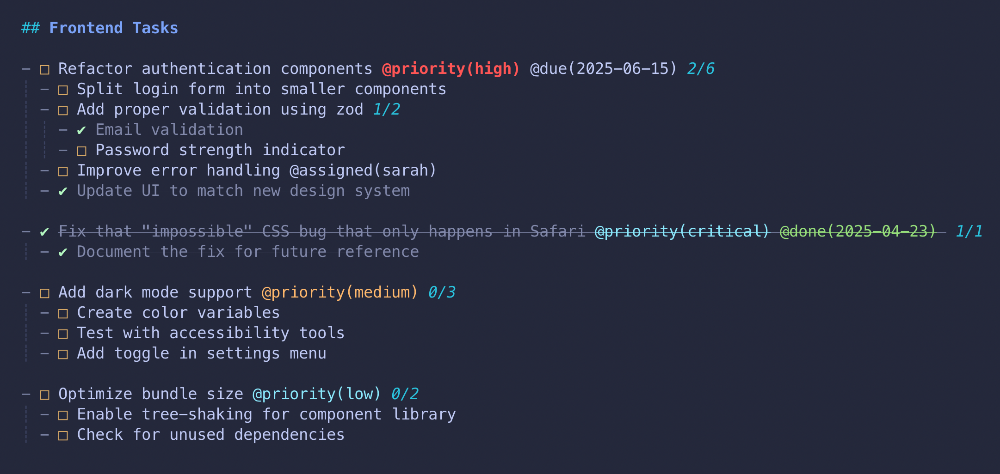
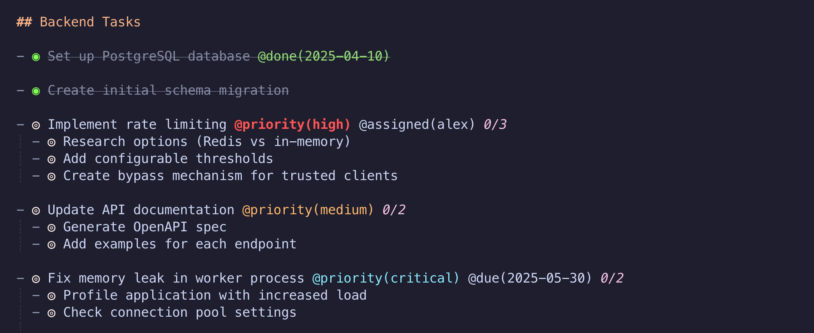
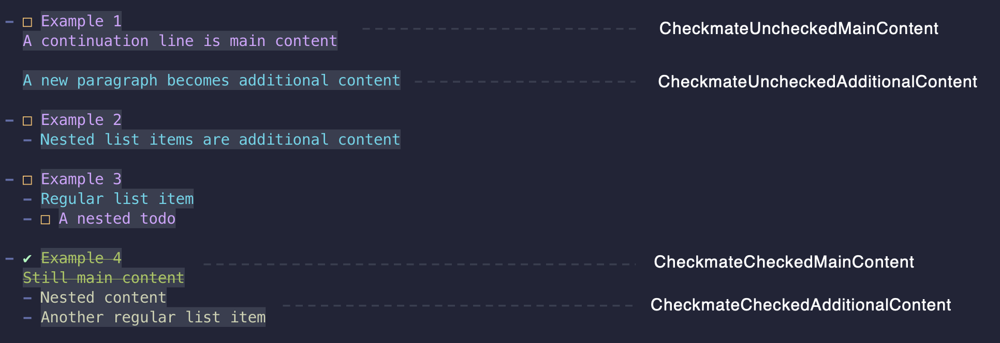
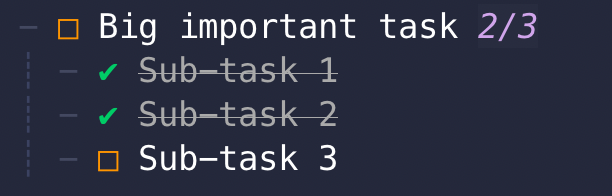
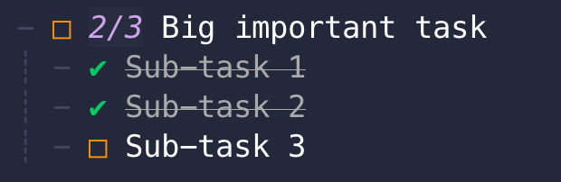
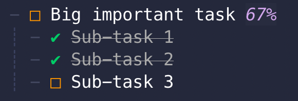
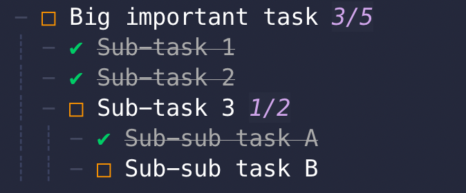

<div align="center">


### Get stuff done

[](http://www.lua.org)
[](https://neovim.io)


</div><br/>

A Markdown-based todo/task plugin for Neovim.

### Features
- Saves files in plain Markdown format (compatible with other apps)
- Customizable markers and styling
- Visual mode support for toggling multiple items at once
- Metadata e.g. `@tag(value)` annotations with extensive customization
  - e.g. @started, @done, @priority, @your-custom-tag
- Todo completion counts
- Smart toggling behavior
- Archive completed todos

> [!NOTE]
> Check out the [Wiki](https://github.com/bngarren/checkmate.nvim/wiki) for additional documentation and recipes, including:
> - [Advanced metadata](https://github.com/bngarren/checkmate.nvim/wiki/Metadata)
> - How to setup a per-project, low-friction `checkmate.nvim` buffer with [snacks.nvim](https://github.com/bngarren/checkmate.nvim/wiki#snacksnvim)

<br/>





https://github.com/user-attachments/assets/d9b58e2c-24e2-4fd8-8d7f-557877a20218

<!-- panvimdoc-ignore-start -->
## Table of Contents
- [Installation](#installation)
- [Requirements](#requirements)
- [Usage](#usage)
- [Commands](#commands)
- [Configuration](#config)
  - [Styling](#styling)
  - [Todo counts](#todo-count-indicator)
  - [Smart toggle](#smart-toggle)
- [Metadata](#metadata)
- [Archiving](#archiving)
- [Integrations](#integrations)
- [Linting](#linting)
- [Roadmap](#roadmap)
- [Contributing](#contributing)
- [Credits](#credits)

<!-- panvimdoc-ignore-end -->

<br>

<a id="installation"><a/>

# ☑️ Installation

## Requirements

- Neovim 0.10 or higher

### Using [lazy.nvim](https://github.com/folke/lazy.nvim)

```lua
{
    "bngarren/checkmate.nvim",
    ft = "markdown", -- Lazy loads for Markdown files matching patterns in 'files'
    opts = {
        -- your configuration here
        -- or leave empty to use defaults
    },

}
```

If you'd like _stable-ish_ version during pre-release, can add a minor version to the [lazy spec](https://lazy.folke.io/spec#spec-versioning):
```
{
  version = "~0.10.0" -- pins to minor 0.10.x
}
```
<a id="usage"><a/>

# ☑️ Usage

### 1. Open or Create a Todo File

Checkmate automatically activates when you open a Markdown file that matches your configured file name patterns.

**Default patterns:**
- `todo` or `TODO` (exact filename)
- `todo.md` or `TODO.md`
- Files with `.todo` extension (e.g., `project.todo`, `work.todo.md`)

<br>

> [!NOTE]
> Checkmate only activates for files with the "markdown" filetype. Files without extensions need their filetype set to markdown (`:set filetype=markdown`)

<br>

You can customize **which files activate Checkmate** using the `files` configuration option:
```lua
files = { "tasks", "*.plan", "project/**/todo.md" }
```
Patterns support full Unix-style globs including `*`, `**`, `?`, `[abc]`, and `{foo,bar}`

### 2. Create Todos

- Use the **mapped key** (_recommended_, default: `<leader>Tn`) or the `:Checkmate create` command
- Or manually using Markdown syntax:

```md
- [ ] Unchecked todo
- [x] Checked todo
```

(These will automatically convert when you leave insert mode!)

### 3. Manage Your Tasks

- Toggle items with `:Checkmate toggle` (default: `<leader>Tt`)
- Check items with `:Checkmate check` (default: `<leader>Tc`)
- Uncheck items with `:Checkmate uncheck` (default: `<leader>Tu`)
- Select multiple items in visual mode and use the same commands
- Archive completed todos with `:Checkmate archive` (default: `<leader>Ta`)

Enhance your todos with custom [metadata](#metadata) with quick keymaps!

The Checkmate buffer is **saved as regular Markdown** which means it's compatible with any Markdown editor!

<a id="commands"><a/>

# ☑️ Commands

#### User commands
`:Checkmate [subcommand]`

| subcommand   | Description |
|--------------|-------------|
| `archive` | Archive all checked todo items in the buffer. See api `archive()` |
| `check` | Mark the todo item under the cursor as checked. See api `check()`|
| `create` | Create a new todo item at the current line or line below if a todo already exists. In visual mode, convert each line to a todo item. See api `create()`|
| `lint` | Lint this buffer for Checkmate formatting issues. See api `lint()` |
| `metadata add` | Add a metadata tag to the todo under the cursor or within the selection. Usage: `:Checkmate metadata add <key> [value]`. See api `add_metadata(key, value)` |
| `metadata jump_next` | Move the cursor to the next metadata tag for the todo item under the cursor. See api `jump_next_metadata()` |
| `metadata jump_previous` | Move the cursor to the previous metadata tag for the todo item under the cursor. See api `jump_previous_metadata()` |
| `metadata remove` | Remove a specific metadata tag from the todo under the cursor or within the selection. Usage: `:Checkmate metadata remove <key>`. See api `remove_metadata(key)` |
| `metadata select_value` | Select a value from the 'choices' option for the metadata tag under the cursor. See api `select_metadata_value()` |
| `metadata toggle` | Toggle a metadata tag on/off for the todo under the cursor or within the selection. Usage: `:Checkmate metadata toggle <key> [value]`. See api `toggle_metadata(key, value)` |
| `remove_all_metadata` | Remove *all* metadata tags from the todo under the cursor or within the selection. See api `remove_all_metadata()` |
| `toggle` | Toggle the todo item under the cursor (normal mode) or all todo items within the selection (visual mode). See api `toggle()` |
| `uncheck` | Mark the todo item under the cursor as unchecked. See api `uncheck()` |

<br>

<a id="config"><a/>

# ☑️ Config

<details>
<summary>Config definitions/annotations</summary>

```lua
---Checkmate configuration
---@class checkmate.Config
---
---Whether the plugin is enabled
---@field enabled boolean
---
---Whether to show notifications
---@field notify boolean
---
--- Filenames or patterns to activate Checkmate on when the filetype is 'markdown'
---
--- Uses Unix-style glob patterns with the following rules:
--- - Patterns are CASE-SENSITIVE (e.g., "TODO" won't match "todo")
--- - Basename patterns (no slash): Match against filename only
---   - "TODO" matches any file named "TODO" regardless of path
---   - "*.md" matches any markdown file in any directory
---   - "*todo*" matches any file with "todo" in the name
--- - Path patterns (has slash):
---   - "docs/*.md" matches markdown files in any "docs" directory
---   - "/home/user/*.md" matches only in that specific directory (absolute)
---   - Both "docs/*.md" and "**/docs/*.md" behave the same (match at any depth)
--- - Glob syntax (refer to `h: vim.glob`):
---   - `*` matches any characters except /
---   - `**` matches any characters including / (recursive)
---   - `?` matches any single character
---   - `[abc]` matches any character in the set
---   - `{foo,bar}` matches either "foo" or "bar"
---
--- Examples:
--- - {"TODO", "todo"} - files named TODO (case variations)
--- - {"*.md"} - all markdown files
--- - {"*todo*", "*TODO*"} - files with "todo" in the name
--- - {"docs/*.md", "notes/*.md"} - markdown in specific directories
--- - {"project/**/todo.md"} - todo.md under any project directory
---@field files string[]
---
---Logging settings
---@field log checkmate.LogSettings
---
---Define the keymap as a dict-style table or a sequence of { rhs, desc, { modes } }
---See `h: vim.set.keymap` for how 'rhs' is treated, including being able to pass a Lua function directly
---Default modes is {"n"}
---@alias checkmate.KeymapConfig {rhs: string|function, desc?: string, modes?: string[]} | table<integer, any>
---
---Keymappings (false to disable)
---
---Deprecation warning: TODO: The `checkmate.Action` string will be deprecated v0.10. Use the checkmate.KeymapConfig table instead.
---
---Setting `keys` to false will not register any keymaps. Setting a specific key to false will not register that default mapping.
---Note: mappings for metadata are set separately in the `metadata` table
---@field keys ( table<string, checkmate.Action|checkmate.KeymapConfig|false>| false )
---
---Characters for todo markers (checked and unchecked)
---@field todo_markers checkmate.TodoMarkers
---
---Default list item marker to be used when creating new Todo items
---@field default_list_marker "-" | "*" | "+"
---
---@field ui? checkmate.UISettings
---
---Highlight settings (merges with defaults, user config takes precedence)
---Default style will attempt to integrate with current colorscheme (experimental)
---May need to tweak some colors to your liking
---@field style checkmate.StyleSettings?
---
---Enter insert mode after `:Checkmate create`, require("checkmate").create()
---@field enter_insert_after_new boolean
---
---Options for smart toggle behavior
---This allows an action on one todo item to recursively affect other todo items in the hierarchy in sensible manner
---The behavior is configurable with the following defaults:
--- - Toggling a todo item to checked will cause all direct children todos to become checked
--- - When all direct child todo items are checked, the parent todo will become checked
--- - Similarly, when a child todo is unchecked, it will ensure the parent todo also becomes unchecked if it was previously checked
--- - Unchecking a parent does not uncheck children by default. This can be changed.
---@field smart_toggle checkmate.SmartToggleSettings
---
---Enable/disable the todo count indicator (shows number of sub-todo items completed)
---@field show_todo_count boolean
---
---Options for todo count indicator position
---@alias checkmate.TodoCountPosition "eol" | "inline"
---
---Position to show the todo count indicator (if enabled)
--- `eol` = End of the todo item line
--- `inline` = After the todo marker, before the todo item text
---@field todo_count_position checkmate.TodoCountPosition
---
---Formatter function for displaying the todo count indicator
---@field todo_count_formatter fun(completed: integer, total: integer)?: string
---
---Whether to count sub-todo items recursively in the todo_count
---If true, all nested todo items will count towards the parent todo's count
---@field todo_count_recursive boolean
---
---Whether to register keymappings defined in each metadata definition. If set the false,
---metadata actions need to be called programatically or otherwise mapped manually
---@field use_metadata_keymaps boolean
---
---Custom @tag(value) fields that can be toggled on todo items
---To add custom metadata tag, add a new field to this table with the metadata properties
---
---Note: When setting metadata in config, entire metadata entries are replaced,
---not deep-merged. To modify only specific fields of default metadata,
---you will need to manually merge the default implementation.
---@field metadata checkmate.Metadata
---
---Settings for the archived todos section
---@field archive checkmate.ArchiveSettings?
---
---Config for the linter
---@field linter checkmate.LinterConfig?
---
---Turn off treesitter highlights (on by default)
---Buffer local
---See `:h treesitter-highlight`
---@field disable_ts_highlights? boolean

-----------------------------------------------------

---Actions that can be used for keymaps in the `keys` table of 'checkmate.Config'
---@deprecated TODO: remove v0.10
---@alias checkmate.Action "toggle" | "check" | "uncheck" | "create" | "remove_all_metadata" | "archive" | "select_metadata_value" | "jump_next_metadata" | "jump_previous_metadata"

-----------------------------------------------------

---@class checkmate.LogSettings
--- Any messages above this level will be logged
---@field level ("trace" | "debug" | "info" | "warn" | "error" | "fatal" | vim.log.levels.DEBUG | vim.log.levels.ERROR | vim.log.levels.INFO | vim.log.levels.TRACE | vim.log.levels.WARN)?
---
--- Should print log output to a file
---@field use_file boolean
---
--- The default path on-disk where log files will be written to.
--- Defaults to `~/.local/share/nvim/checkmate/current.log` (Unix) or `C:\Users\USERNAME\AppData\Local\nvim-data\checkmate\current.log` (Windows)
---@field file_path string?
---
--- Should print log output to a scratch buffer
--- Open with `:Checkate debug log` or `require("checkmate").debug_log()`
---@field use_buffer boolean

-----------------------------------------------------

--- The text string used for todo markers is expected to be 1 character length.
--- Multiple characters _may_ work but are not currently supported and could lead to unexpected results.
---@class checkmate.TodoMarkers
---
---Character used for unchecked items
---@field unchecked string
---
---Character used for checked items
---@field checked string

-----------------------------------------------------

---@class checkmate.UISettings
---
---@alias checkmate.Picker "telescope" | "snacks" | "mini" | false | fun(items: string[], opts: {on_choice: function})
---Default behavior: attempt to use an installed plugin, if found
---If false, will default to vim.ui.select
---If a function is passed, will use this picker implementation
---@field picker? checkmate.Picker

-----------------------------------------------------

---@class checkmate.SmartToggleSettings
---
---Whether to enable smart toggle behavior
---Default: true
---@field enabled boolean?
---
---How checking a parent affects its children
---  - "all_children": Check all descendants, including nested
---  - "direct_children": Only check direct children (default)
---  - "none": Don't propagate down
---@field check_down "all_children"|"direct_children"|"none"?
---
---How unchecking a parent affects its children
---  - "all_children": Uncheck all descendants, including nested
---  - "direct_children": Only uncheck direct children
---  - "none": Don't propagate down (default)
---@field uncheck_down "all_children"|"direct_children"|"none"?
---
---When a parent should become checked
---i.e, how a checked child affects its parent
---  - "all_children": When ALL descendants are checked, including nested
---  - "direct_children": When all direct children are checked (default)
---  - "none": Never auto-check parents
---@field check_up "all_children"|"direct_children"|"none"?
---
---When a parent should become unchecked
---i.e, how a unchecked child affects its parent
---  - "all_children": When ANY descendant is unchecked
---  - "direct_children": When any direct child is unchecked (default)
---  - "none": Never auto-uncheck parents
---@field uncheck_up "all_children"|"direct_children"|"none"?

-----------------------------------------------------

--- Style

---@deprecated TODO: remove v0.10 - use checkmate.HighlightGroup instead
---
---@alias checkmate.StyleKey
---| "list_marker_unordered"
---| "list_marker_ordered"
---| "unchecked_marker"
---| "unchecked_main_content"
---| "unchecked_additional_content"
---| "checked_marker"
---| "checked_main_content"
---| "checked_additional_content"
---| "todo_count_indicator"

---@alias checkmate.HighlightGroup
---| "CheckmateListMarkerUnordered" -- unordered list markers (-,+,*)
---| "CheckmateListMarkerOrdered" -- ordered (numerical) list markers (1.,2.)
---| "CheckmateUncheckedMarker" -- unchecked markers (□)
---| "CheckmateUncheckedMainContent" -- main content of unchecked todo items (typically 1st paragraph)
---| "CheckmateUncheckedAdditionalContent" -- additional content of unchecked todo items (subsequent paragraphs or list items)
---| "CheckmateCheckedMarker" -- checked markers (✔)
---| "CheckmateCheckedMainContent" -- main content of checked todo items (typically 1st paragraph)
---| "CheckmateCheckedAdditionalContent" -- additional content of checked todo items (subsequent paragraphs or list items)
---| "CheckmateTodoCountIndicator" -- the todo count indicator (e.g. x/x)

---Customize the style of markers and content
---@alias checkmate.StyleSettings table<checkmate.StyleKey|checkmate.HighlightGroup, vim.api.keyset.highlight>

-----------------------------------------------------

--- Metadata

---A table of canonical metadata tag names and associated properties that define the look and function of the tag
---
---A 'canonical' name is the main lookup name for a metadata tag; additional 'aliases' can be used that point to this name
---@alias checkmate.Metadata table<string, checkmate.MetadataProps>

---@class checkmate.MetadataProps
---
---Additional string values that can be used interchangably with the canonical tag name.
---E.g. @started could have aliases of `{"initiated", "began"}` so that @initiated and @began could
---also be used and have the same styling/functionality
---@field aliases? string[]
---
---@alias checkmate.StyleFn
---| fun(value?: string):vim.api.keyset.highlight -- Legacy (to be removed in future release)
---| fun(context?: checkmate.MetadataContext):vim.api.keyset.highlight
---
---Highlight settings table, or a function that returns highlight settings (being passed metadata context)
---@field style? vim.api.keyset.highlight|checkmate.StyleFn
---
---@alias checkmate.GetValueFn fun(context?: checkmate.MetadataContext):string
---
---Function that returns the default value for this metadata tag
---i.e. what is used after insertion
---@field get_value? checkmate.GetValueFn
---
---@alias checkmate.ChoicesFn fun(context?: checkmate.MetadataContext, cb?: fun(items: string[])): string[]?
---
---Values that are populated during completion or select pickers
---Can be either:
--- - An array of items (string[])
--- - A function that returns items
---@field choices? string[]|checkmate.ChoicesFn
---
---Keymapping for toggling (adding/removing) this metadata tag
---Can also pass a tuple (key, desc) to include a description
---@field key? string|string[]
---
---Used for displaying metadata in a consistent order
---@field sort_order? integer
---
---Moves the cursor to the metadata after it is inserted
---  - "tag" - moves to the beginning of the tag
---  - "value" - moves to the beginning of the value
---  - false - disables jump (default)
---@field jump_to_on_insert? "tag" | "value" | false
---
---Selects metadata text in visual mode after metadata is inserted
---The `jump_to_on_insert` field must be set (not false)
---The selected text will be the tag or value, based on jump_to_on_insert setting
---Default (false) - off
---@field select_on_insert? boolean
---
---Callback to run when this metadata tag is added to a todo item
---E.g. can be used to change the todo item state
---@field on_add? fun(todo_item: checkmate.TodoItem)
---
---Callback to run when this metadata tag is removed from a todo item
---E.g. can be used to change the todo item state
---@field on_remove? fun(todo_item: checkmate.TodoItem)
---
---Callback to run when this metadata tag's value is changed (not on initial add or removal)
---Receives the todo item, old value, and new value
---@field on_change? fun(todo_item: checkmate.TodoItem, old_value: string, new_value: string)

-----------------------------------------------------

---@class checkmate.ArchiveSettings
---
---Defines the header section for the archived todos
---@field heading checkmate.ArchiveHeading
---
---Number of blank lines between archived todo items (root only)
---@field parent_spacing integer?
---
---How to arrange newly added archived todos
---If true, newly added todos will be added to the top of the archive section
---Default: true
---@field newest_first boolean?

---@class checkmate.ArchiveHeading
---
---Name for the archived todos section
---Default: "Archived"
---@field title string?
---
---The heading level (e.g. #, ##, ###, ####)
---Integers 1 to 6
---Default: 2 (##)
---@field level integer?

-----------------------------------------------------

---@class checkmate.LinterConfig
---
---Whether to enable the linter (vim.diagnostics)
---Default: true
---@field enabled boolean
---
---Map of issues to diagnostic severity level
---@field severity table<string, vim.diagnostic.Severity>?
--- TODO: @field auto_fix boolean Auto fix on buffer write
---
---Whether to use verbose linter/diagnostic messages
---Default: false
---@field verbose boolean?
```

</details>

### Defaults
```lua
---@type checkmate.Config
local defaults = {
  enabled = true,
  notify = true,
  -- Default file matching:
  --  - Any `todo` or `TODO` file, including with `.md` extension
  --  - Any `.todo` extension (can be ".todo" or ".todo.md")
  -- To activate Checkmate, the filename must match AND the filetype must be "markdown"
  files = {
    "todo",
    "TODO",
    "todo.md",
    "TODO.md",
    "*.todo",
    "*.todo.md",
  },
  log = {
    level = "info",
    use_file = false,
    use_buffer = false,
  },
  -- Default keymappings
  keys = {
    ["<leader>Tt"] = {
      rhs = "<cmd>Checkmate toggle<CR>",
      desc = "Toggle todo item",
      modes = { "n", "v" },
    },
    ["<leader>Tc"] = {
      rhs = "<cmd>Checkmate check<CR>",
      desc = "Set todo item as checked (done)",
      modes = { "n", "v" },
    },
    ["<leader>Tu"] = {
      rhs = "<cmd>Checkmate uncheck<CR>",
      desc = "Set todo item as unchecked (not done)",
      modes = { "n", "v" },
    },
    ["<leader>Tn"] = {
      rhs = "<cmd>Checkmate create<CR>",
      desc = "Create todo item",
      modes = { "n", "v" },
    },
    ["<leader>TR"] = {
      rhs = "<cmd>Checkmate remove_all_metadata<CR>",
      desc = "Remove all metadata from a todo item",
      modes = { "n", "v" },
    },
    ["<leader>Ta"] = {
      rhs = "<cmd>Checkmate archive<CR>",
      desc = "Archive checked/completed todo items (move to bottom section)",
      modes = { "n" },
    },
    ["<leader>Tv"] = {
      rhs = "<cmd>Checkmate metadata select_value<CR>",
      desc = "Update the value of a metadata tag under the cursor",
      modes = { "n" },
    },
    ["<leader>T]"] = {
      rhs = "<cmd>Checkmate metadata jump_next<CR>",
      desc = "Move cursor to next metadata tag",
      modes = { "n" },
    },
    ["<leader>T["] = {
      rhs = "<cmd>Checkmate metadata jump_previous<CR>",
      desc = "Move cursor to previous metadata tag",
      modes = { "n" },
    },
  },
  default_list_marker = "-",
  todo_markers = {
    unchecked = "□",
    checked = "✔",
  },
  style = {}, -- override defaults
  enter_insert_after_new = true, -- Should enter INSERT mode after `:Checkmate create` (new todo)
  smart_toggle = {
    enabled = true,
    check_down = "direct_children",
    uncheck_down = "none",
    check_up = "direct_children",
    uncheck_up = "direct_children",
  },
  show_todo_count = true,
  todo_count_position = "eol",
  todo_count_recursive = true,
  use_metadata_keymaps = true,
  metadata = {
    -- Example: A @priority tag that has dynamic color based on the priority value
    priority = {
      style = function(context)
        local value = context.value:lower()
        if value == "high" then
          return { fg = "#ff5555", bold = true }
        elseif value == "medium" then
          return { fg = "#ffb86c" }
        elseif value == "low" then
          return { fg = "#8be9fd" }
        else -- fallback
          return { fg = "#8be9fd" }
        end
      end,
      get_value = function()
        return "medium" -- Default priority
      end,
      choices = function()
        return { "low", "medium", "high" }
      end,
      key = "<leader>Tp",
      sort_order = 10,
      jump_to_on_insert = "value",
      select_on_insert = true,
    },
    -- Example: A @started tag that uses a default date/time string when added
    started = {
      aliases = { "init" },
      style = { fg = "#9fd6d5" },
      get_value = function()
        return tostring(os.date("%m/%d/%y %H:%M"))
      end,
      key = "<leader>Ts",
      sort_order = 20,
    },
    -- Example: A @done tag that also sets the todo item state when it is added and removed
    done = {
      aliases = { "completed", "finished" },
      style = { fg = "#96de7a" },
      get_value = function()
        return tostring(os.date("%m/%d/%y %H:%M"))
      end,
      key = "<leader>Td",
      on_add = function(todo_item)
        require("checkmate").set_todo_item(todo_item, "checked")
      end,
      on_remove = function(todo_item)
        require("checkmate").set_todo_item(todo_item, "unchecked")
      end,
      sort_order = 30,
    },
  },
  archive = {
    heading = {
      title = "Archive",
      level = 2, -- e.g. ##
    },
    parent_spacing = 0, -- no extra lines between archived todos
    newest_first = true,
  },
  linter = {
    enabled = true,
  },
}
```

> [!WARNING]
> Multi-character todo markers are not officially supported but _may_ work. For consistent behavior, recommend using a single character.

## Keymapping
Default keymaps can be disabled by setting `keys = false`.

Keymaps should be defined as a dict-like table or a sequence of `{rhs, desc?, modes?}`.

```lua
keys = {
  ["<leader>Ta"] = {
      rhs = "<cmd>Checkmate archive<CR>",
      desc = "Archive todos",
      modes = { "n" },
  },
}
```

or

```lua
keys = {
  ["<leader>Ta"] = {"<cmd>Checkmate archive<CR>", "Archive todos", {"n"} }
}
```

The `rhs` parameter follows `:h vim.keymap.set()` and can be a string or Lua function.

## Styling
Default styles are calculated based on the current _colorscheme_. This attempts to provide reasonable out-of-the-box defaults based on colorscheme-defined hl groups and contrast ratios.

Individual styles can still be overriden using the `style` option and passing a 'highlight definition map' according to `:h nvim_set_hl()` and `vim.api.keyset.highlight` for the desired highlight group (see below).

### Highlight groups
| hl_group | description |
|----------|-------------|
| CheckmateListMarkerUnordered | Unordered list markers, e.g. `-`,`*`, and `+`. (_Only those associated with a todo_) |
| CheckmateListMarkerOrdered | Ordered list markers, e.g. `1.`, `2)`. (_Only those associated with a todo_) |
| CheckmateUncheckedMarker | Unchecked todo marker, e.g. `□`. See `todo_markers` option |
| CheckmateUncheckedMainContent | The main content of an unchecked todo (typically the first paragraph) |
| CheckmateUncheckedAdditionalContent | Additional content for an unchecked todo (subsequent paragraphs, list items, etc.) |
| CheckmateCheckedMarker | Checked todo marker, e.g. `✔`. See `todo_markers` option |
| CheckmateCheckedMainContent | The main content of a checked todo (typically the first paragraph) |
| CheckmateCheckedAdditionalContent | Additional content for a checked todo (subsequent paragraphs, list items, etc.) |
| CheckmateTodoCountIndicator | The todo count indicator, e.g. `1/4`, shown on the todo line, if enabled. See `show_todo_count` option |

Metadata highlights are prefixed with `CheckmateMeta_` and keyed with the tag name and style.

### Example: Change the checked marker to a bold green
```lua
opts = {
    style = {
        CheckmateCheckedMarker = { fg = "#7bff4f", bold = true}
    }
}
```
#### Main content versus Additional content
Highlight groups with 'MainContent' refer to the todo item's first paragraph. 'AdditionalContent' refers to subsequent paragraphs, list items, etc.



## Todo count indicator

<table>
  <tr>
    <td align="center">
      <br/>
      <sub>Todo count indicator using <code>eol</code> position</sub>
    </td>
    <td align="center">
      <br/>
      <sub>Todo count indicator using <code>inline</code> position</sub>
    </td>
  </tr>
</table>

#### Change the default display by passing a custom formatter

```lua
-- Custom formatter that returns the % completed
todo_count_formatter = function(completed, total)
  return string.format("%.0f%%", completed / total * 100)
end,
```

<br/>
<sub>Todo count indicator using <code>todo_count_formatter</code> function</sub>

#### Count all nested todo items
If you want the todo count of a parent todo item to include _all_ nested todo items, set the recursive option.

```lua
todo_count_recursive = true,
```
<br/>
<sub>Todo count indicator using <code>recursive</code> option. The children of 'Sub-task 3' are included in the overall count of 'Big important task'.</sub> 

## Smart Toggle

Smart toggle provides intelligent parent-child todo state propagation. When you toggle a todo item, it can automatically update related todos based on your configuration.

### How it works

Smart toggle operates in two phases:
1. **Downward propagation**: When toggling a parent, optionally propagate the state change to children
2. **Upward propagation**: When toggling a child, optionally update the parent based on children states

### Configuration

Smart toggle is enabled by default with sensible defaults. You can customize the behavior:

```lua
opts = {
  smart_toggle = {
    enabled = true,
    check_down = "direct",        -- How checking a parent affects children
    uncheck_down = "none",        -- How unchecking a parent affects children
    check_up = "direct_children", -- When to auto-check parents
    uncheck_up = "direct_children", -- When to auto-uncheck parents
  }
}
```
<a id="metadata"><a/>

# ☑️ Metadata

Metadata tags allow you to add custom `@tag(value)` annotations to todo items.

<br/>

- Default tags:
  - `@started` - default value is the current date/time
  - `@done` - default value is the current date/time
  - `@priority` - "low" | "medium" (default) | "high"

The default tags are not deeply merged in order to avoid unexpected behavior. If you wish to modify a default metadata, you should copy the default implementation.

By configuring a metadata's `choices` option, you can populate your own lists of metadata values for powerful workflows, e.g. project file names, Git branches, PR's, issues, etc., team member names, external APIs, etc.

For in-depth guide and recipes for custom metadata, see the [Wiki](https://github.com/bngarren/checkmate.nvim/wiki/Todo-Metadata) page.

<a id="archiving"><a/>

# ☑️ Archiving
Allows you to easily reorganize the buffer by moving all checked/completed todo items to a Markdown section beneath all other content. The unchecked todos are reorganized up top and spacing is adjusted.

See `Checkmate archive` command or `require("checkmate").archive()`

> Current behavior (could be adjusted in the future): a checked todo item that is nested under an unchecked parent will not be archived. This prevents 'orphan' todos being separated from their parents. Similarly, a checked parent todo will carry all nested todos (checked and unchecked) when archived.

#### Heading
By default, a Markdown level 2 header (##) section named "**Archive**" is used. You can configure the archive section heading via `config.archive.heading`

The following will produce an archive section labeled:
```markdown
#### Completed
```

```lua
opts = {
  archive = {
    heading = {
      title = "Completed",
      level = 4
    }
  }
}
```

#### Spacing
The amount of blank lines between each archived todo item can be customized via `config.archive.parent_spacing`

E.g. `parent_spacing = 0`
```lua
## Archive

- ✔ Update the dependencies 
- ✔ Refactor the User api
- ✔ Add additional tests 
```

E.g. `parent_spacing = 1`
```lua
## Archive

- ✔ Update the dependencies 

- ✔ Refactor the User api

- ✔ Add additional tests 
```

<a id="integrations"><a/>

# ☑️ Integrations

Please see [Wiki](https://github.com/bngarren/checkmate.nvim/wiki) for additional details/recipes.

| integration | capable? |
|----------------|----------|
| [render-markdown](https://github.com/MeanderingProgrammer/render-markdown.nvim) | ✅ [wiki](https://github.com/bngarren/checkmate.nvim/wiki#render-markdownnvim)|
| scratch buffer/floating window for quick todos, e.g. [snacks.nvim](https://github.com/folke/snacks.nvim/blob/main/docs/scratch.md) | ✅ [wiki](https://github.com/bngarren/checkmate.nvim/wiki#snacksnvim) |


<a id="linting"><a/>

# ☑️ Linting
Checkmate uses a _very_ limited custom linter in order require zero dependencies but attempt to warn the user of Markdown (CommonMark spec) formatting issues that could cause unexpected plugin behavior.

> The embedded linter is NOT a general-purpose Markdown linter and _may_ interfere with other linting tools. Though, in testing with conform.nvim and prettier, I have not found any issues.

#### Example

❌ misaligned list marker
```md
1. ☐ Parent todo item
  - ☐ Child todo item (indented only 2 spaces!)
```

✅ correctly aligned list marker
```md
1. ☐ Parent todo item
   - ☐ Child todo item (indented 3 spaces!)
```
The [CommonMark spec](https://spec.commonmark.org/current) requires that nested list markers begin at the col of the first non-whitespace content after the parent list marker (which will be a different col for bullet list vs ordered list markers)

If you feel comfortable with the nuances of Markdown list syntax, you can disable the linter (default is enabled) via config:
```lua
{
  linter = {
    enabled = false
  }
}
```

<a id="roadmap"><a/>

# ☑️ Roadmap

Planned features:

- [x] **Metadata support** - mappings for quick addition of metadata/tags such as @start, @done, @due, @priority, etc. with custom highlighting. _Added v0.2.0_

- [x] **Sub-task counter** - add a completed/total count (e.g. 1/4) to parent todo items. _Added v0.3.0_

- [x] **Archiving** - manually or automatically move completed items to the bottom of the document. _Added v0.7.0_ (experimental)

- [x] **Smart toggling** - toggle all children checked if a parent todo is checked. Toggle a parent checked if the last unchecked child is checked. _Added v0.7.0_ 

- [x] **Metadata upgrade** - callbacks, async support, jump to. _Added v0.9.0_

- [ ] Sorting API - user can register custom sorting functions and keymap them so that sibling todo items can be reordered quickly. e.g. `function(todo_a, todo_b)` should return an integer, and where todo_a/todo_b is a table containing data such as checked state and metadata tag/values

<a id="contributing"><a/>

# ☑️ Contributing

If you have feature suggestions or ideas, please feel free to open an issue on GitHub!

<a id="credits"><a/>

# ☑️ Credits

- Inspired by the [Todo+](https://github.com/fabiospampinato/vscode-todo-plus) VS Code extension (credit to @[fabiospampinato](https://github.com/fabiospampinato))
